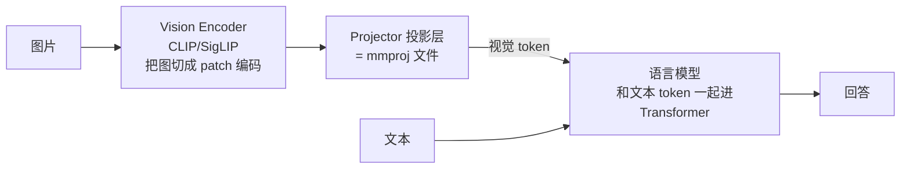

# mmproj 多模态投影 (Multimodal Projector)

## 面试定义（可直接背）
> "A multimodal projector is a small adapter module that maps the output embeddings of a vision encoder (like CLIP) into the language model's embedding space, so image patches can be fed to the LLM as if they were text tokens."

## 视觉模型的三段式结构

## 在 llama.cpp 里
- mmproj 是独立的 GGUF 文件（architecture = `clip`），通过 `--mmproj <file>` 挂在主模型上
- 多模态能力由 **mtmd** 组件提供，支持的 projector 类型写死在构建里（本机实测支持 `qwen2vl` / `qwen3vl` / `gemma4v`）
- 验证是否挂上：`GET /v1/models` 看 capabilities 里有 `"multimodal"`
- 图片经 encoder 后变成几十个到几百个 token，算进 prompt token 数（实测 64x64 小图 ≈ 50 token）

## 实战教训
- **mmproj 必须和主模型配套**（同系列、同 embedding 维度），但不是所有 HF 页面都会把它放在显眼位置——下载模型时检查有没有配套视觉文件
- llama.cpp router 模式的 models.ini 里，`mmproj` 路径相对**服务器工作目录**解析，不相对 `--models-dir`

## Related

- [[gguf|GGUF]]
- [[llama-cpp-router-模式|llama.cpp Router 模式]]
- [[gemma4-26b-本地部署实战|Gemma4-26B 本地部署实战]]
