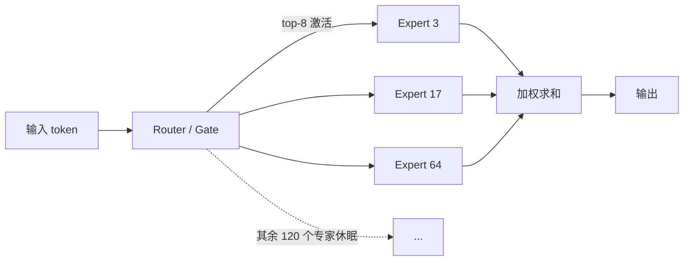

# MoE (Mixture of Experts)

# MoE (Mixture of Experts) 混合专家

## 面试定义（可直接背）
> "Mixture of Experts is a sparse neural network architecture where each token is routed to only a small subset of 'expert' feed-forward networks, so the model's total parameter count can be huge while the compute per token stays small."

## 核心思想
稠密模型（Dense）：每个 token 前向传播要过**全部**参数。
MoE：把 FFN 层复制成 N 份（专家），加一个**路由器（Router / Gate）**，每个 token 只激活其中 top-k 个专家。

## 本次实战案例：Gemma4-26B-A4B
- **26B** = 总参数量（total parameters）
- **A4B** = 每 token 激活参数（activated parameters）≈ 4B
- 128 个专家，每 token 激活 8 个

## 为什么对本地推理是革命性的
推理速度瓶颈在**内存带宽**（每生成 1 个 token 都要把激活的参数从显存读一遍）：
- 稠密 27B：每 token 读 ~16GB 权重 → Strix Halo 上只有 5-10 t/s
- MoE 26B-A4B：每 token 只读 ~4B 激活部分 → 实测 60-78 t/s

**容量对标 26B，速度对标 4B**，这就是 MoE 的价值。

## Trade-off
- 显存占用按**总参数**算（26B 的 Q4 还是要 16.8GB），MoE 省的是带宽不是显存
- 路由开销、专家负载不均衡是训练侧的经典难题

## 相关
[[Speculative Decoding]] [[统一内存 Unified Memory]] [[Gemma4-26B 本地部署实战]]

## Related

- [[Speculative Decoding]]
- [[统一内存 Unified Memory]]
- [[GGUF]]
- [[Gemma4-26B 本地部署实战]]
