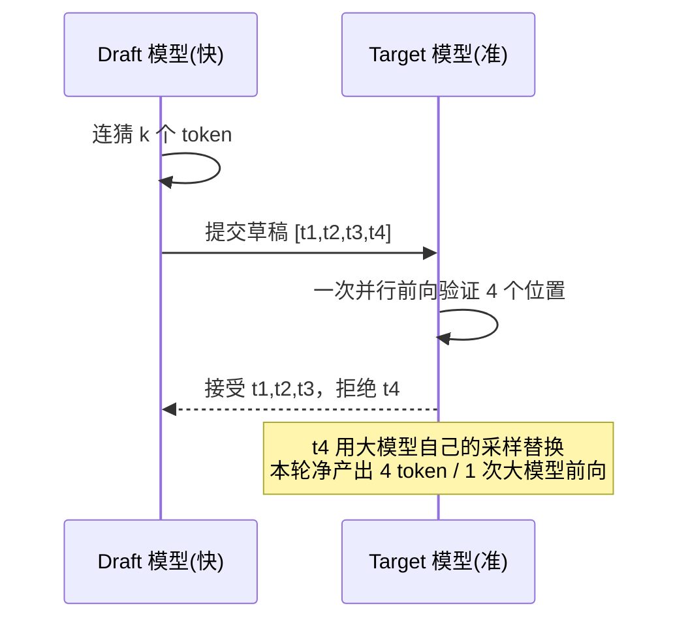

# Speculative Decoding

# Speculative Decoding 投机解码

## 面试定义（可直接背）
> "Speculative decoding accelerates autoregressive inference by using a small, fast draft model to propose several tokens ahead, which the large target model then verifies in a single parallel forward pass — accepted tokens are kept, so output is identical to the target model's, just faster."

## 解决的问题
LLM 逐 token 生成是**串行**的：生成第 N 个 token 必须等第 N-1 个完成。每步都做一次完整前向，GPU 算力大量闲置（瓶颈在显存带宽而非算力）。

## 工作流程
1. **Draft（起草）**：小模型/草稿头快速连猜 k 个 token
2. **Verify（验证）**：大模型**一次并行前向**同时给这 k 个位置打分
3. **Accept/Reject**：逐位比对，接受最长前缀；第一个被拒绝的位置由大模型自己的输出替换，之后的草稿全部丢弃

关键点：**输出分布与不用投机解码完全一致**——大模型验证了每个 token，这是纯加速，不是近似。

## MTP (Multi-Token Prediction)
Gemma4 / Qwen3.8 用的方案：不在主模型外挂小模型，而是在主模型上多训练一个**轻量预测头（draft head）**，与主模型共享大部分权重，加载时只有 241MB。
llama.cpp 用法：`--spec-type draft-mtp -md <mtp.gguf>`（外置）或融合版 GGUF 免 `-md`（内嵌）。

## 实战数据（Strix Halo + Gemma4-26B）
- 英文/代码：接受率 **88%**（95/108），速度 61-78 t/s（+35%）
- 中文长文：接受率降到 ~58%（草稿和主模型分布差异大的领域接受率就低）
- 接受率 = 草稿质量的直接指标，llama.cpp 的 timings 里看 `draft_n_accepted / draft_n`

## Trade-off
- 多花一份草稿的显存和计算，换主模型前向次数减少
- 接受率低时可能**负优化**（草稿白算），所以 batch 大、带宽不是瓶颈时不一定划算

## 相关
[[MoE (Mixture of Experts)]] [[llama.cpp Router 模式]] [[Gemma4-26B 本地部署实战]]

## Related

- [[MoE (Mixture of Experts)]]
- [[llama.cpp Router 模式]]
- [[统一内存 Unified Memory]]
- [[Gemma4-26B 本地部署实战]]
