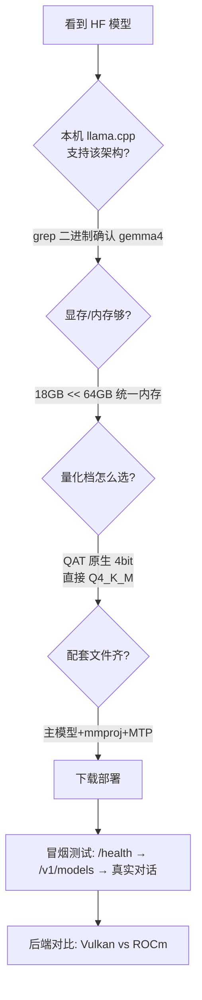

# Gemma4-26B 本地部署实战

> 一次完整的本地大模型部署学习：从 HF 选型到 TUI 集成，Strix Halo APU + llama.cpp。
> 时间：2026-08；环境：AMD Radeon 8060S (Strix Halo, 64GB 统一内存) + Windows + llama.cpp build 10448。

## 最终成果
- Gemma4-26B-A4B QAT Q4_K_M（16.8GB）+ mmproj 视觉（1.2GB）+ 外置 MTP（241MB）
- 实测 **60-78 t/s**（Vulkan），MTP 接受率最高 88%
- 双模型（Gemma4 + Qwen3.8-27B）统一收进 PowerShell TUI，router / 单模型双模式

## 部署决策链（选型逻辑可复用）

## 关键经验（按价值排序）
1. **部署前先验证 llama.cpp 构建支持目标架构**：`grep -aoi 'gemma[0-9]' llama.dll`，别等下载 17GB 才发现不支持
2. **带宽瓶颈平台（APU）首选 MoE + MTP**：容量吃总参数，速度看激活参数，详见 [[moe-mixture-of-experts|MoE (Mixture of Experts)]] 和 [[统一内存-unified-memory|统一内存 Unified Memory]]
3. **QAT 模型直接拿官方甜点量化档**，不纠结，详见 [[qat-quantization-aware-training|QAT (Quantization-Aware Training)]]
4. **后端对比要看 op 覆盖**：ROCm 缺 TOP_K 算子导致采样回退 CPU，比 Vulkan 慢 10-20%，详见 [[vulkan-vs-rocm-后端|Vulkan vs ROCm 后端]]
5. ** timings 里的 draft_n_accepted/draft_n 是投机解码健康度指标**，详见 [[speculative-decoding|Speculative Decoding]]
6. **router 模式模型名 = 预设名（不带路径）**，models.ini 里 mmproj/model-draft 路径相对工作目录，详见 [[llama-cpp-router-模式|llama.cpp Router 模式]]
7. **mmproj 要和主模型配套且记得挂载**，capabilities 里确认 "multimodal"，详见 [[mmproj-多模态投影|mmproj 多模态投影]]
8. 日志看不到详细信息：新版 llama.cpp 默认 verbosity=3，加 `-lv 4`

## 清理原则
- 模型换代后，旧的外挂 draft/非融合主模型即成孤儿，及时删（本次释放 4.6GB）
- 启动脚本全部收编进 TUI（LocalModel.ps1），散落 .cmd 全删，单一入口

## Related

- [[moe-mixture-of-experts|MoE (Mixture of Experts)]]
- [[speculative-decoding|Speculative Decoding]]
- [[dflash|DFlash]]
- [[qat-quantization-aware-training|QAT (Quantization-Aware Training)]]
- [[gguf|GGUF]]
- [[mmproj-多模态投影|mmproj 多模态投影]]
- [[llama-cpp-router-模式|llama.cpp Router 模式]]
- [[vulkan-vs-rocm-后端|Vulkan vs ROCm 后端]]
- [[统一内存-unified-memory|统一内存 Unified Memory]]
